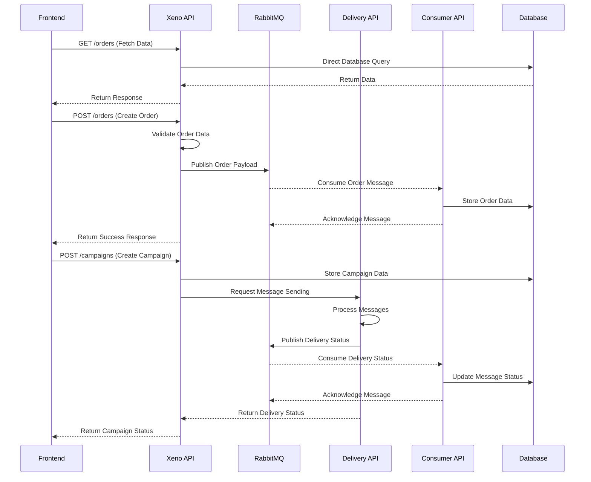

# Xeno Mini CRM & Campaign Management App

This repository contains the backend code for the Xeno Mini CRM & Campaign Management App, which helps manage customer data, create audience segments, and send personalized campaign messages.

The backend is split into three services:
1. **xeno-api** - Handles all HTTP requests for managing customers, orders, campaigns, and audience segments.
2. **consumer-api** - Consumes messages from the RabbitMQ queue and processes them (inserts data into MySQL database).
3. **delivery-api** - Handles the sending of campaign messages and updates their status in the database.

---

## Tech Stack

- **Backend**:
  - Node.js (Express)
- **Database**: MySQL
- **Message Broker**: RabbitMQ
---

## Features

1. **Data Ingestion API**:
   - APIs to accept and store customer and order data in MySQL database.
   - Data is validated in the `xeno-api` and pushed to RabbitMQ for storage by the `consumer-api`.
   - Scalable using the pub-sub architecture.

2. **Campaign & Audience Management**:
   - Allows users to define audience segments based on customer data.
   - Supports complex logic for audience segmentation using AND/OR conditions.
   - Displays campaign history and statistics.
   
3. **Message Sending**:
   - Sends personalized campaign messages to the audience.
   - Calls the `delivery-api` to process message sending and update the delivery status.
   - Status is updated to MySQL (message status: SENT/FAILED).

4. **Google Authentication**:
   - Google OAuth integration for accessing the app securely.

---

## Services Overview

### 1. **xeno-api**
- Handles HTTP requests related to:
  - Customer data and order ingestion.
  - Audience segment creation.
  - Campaign creation and management.
  - Sending personalized campaign messages (by publishing messages to RabbitMQ).
  
### 2. **consumer-api**
- Consumes messages from RabbitMQ.
- Processes the data and stores it into MySQL (inserts campaign data, audience segments, etc.).

### 3. **delivery-api**
- Receives requests from the `xeno-api` to send campaign messages.
- Simulates sending messages with a 90% success rate (SENT) and 10% failure rate (FAILED).
- Updates the status of messages in the MySQL database.

---
## System Architecture

The system follows an event-driven architecture with direct database access for read operations. Below is a sequence diagram showing the main flows:



### Flow Explanation

1. **Data Retrieval (GET Requests)**
   - Frontend requests data from Xeno API
   - Xeno API directly queries the database
   - Data is returned to the frontend

2. **Order Creation (POST Requests)**
   - Frontend submits order data
   - Xeno API validates and publishes to RabbitMQ
   - Consumer API processes the message and stores in database
   - Asynchronous confirmation flow

3. **Campaign Management**
   - Frontend initiates campaign creation
   - Xeno API coordinates with Delivery API for message sending
   - Status updates flow through RabbitMQ to Consumer API
   - Database is updated with delivery status

---
## Installation

### Prerequisites
1. **Node.js** (>=18.x)
2. **MySQL** (Running locally or in a cloud environment)
3. **RabbitMQ** (Running locally or in a cloud environment)

### Setup Steps

1. Clone the repository:
   ```bash
   git clone https://github.com/yourusername/xeno-mini-crm.git
   cd xeno-mini-crm
   ```

2. Install dependencies for each service:

   For **xeno-api**:
   ```bash
   cd xeno-api
   npm install
   ```

   For **consumer-api**:
   ```bash
   cd consumer-api
   npm install
   ```

   For **delivery-api**:
   ```bash
   cd delivery-api
   npm install
   ```

3. Set up environment variables:
   - Create a `.env` file in each service's folder and add the necessary configuration like database credentials, RabbitMQ URI, and Google OAuth credentials.

4. Start each service with `nodemon`:

   - For **xeno-api**:
   ```bash
   nodemon server.ts
   ```

   - For **consumer-api**:
   ```bash
   nodemon server.ts
   ```

   - For **delivery-api**:
   ```bash
   nodemon server.ts
   ```

---

---

## API Documentation

### Postman Collection

You can access the Postman collection for testing the API functionality by clicking the link below:

- [Xeno Mini CRM & Campaign Management API Documentation](https://documenter.getpostman.com/view/21877920/2sAYBPnEsh)

This collection includes all the necessary endpoints and sample requests for testing the features of the Xeno Mini CRM & Campaign Management App.

---

## Running Locally with Docker

To run all services together using Docker Compose:

1. Make sure Docker and Docker Compose are installed.
2. Run the following command to start all services:
   ```bash
   docker-compose up --build
   ```

---

## Testing the API with Postman

You can test the backend API functionality using Postman. The following endpoints can be tested:

1. **POST /customers**: Add a new customer with required data.
2. **POST /orders**: Add order data.
3. **POST /audience-segment**: Define a new audience segment and check if the calculation for audience size works.
4. **POST /campaigns**: Create a new campaign and check if the messages are sent to the `delivery-api`.

---

## Deployment

For deployment, you can use any cloud provider like AWS, GCP, or DigitalOcean to host the services. Ensure RabbitMQ and MySQL are running and accessible by all services. You can use Docker or Kubernetes for containerized deployments.

---

## Demo Video

Once the project is deployed and running, record a **5-minute demo video** showcasing:

- The API functionality (using Postman).
- The web app (if frontend is part of your submission).
- Google Authentication integration.
- Campaign creation and message sending workflow.

---